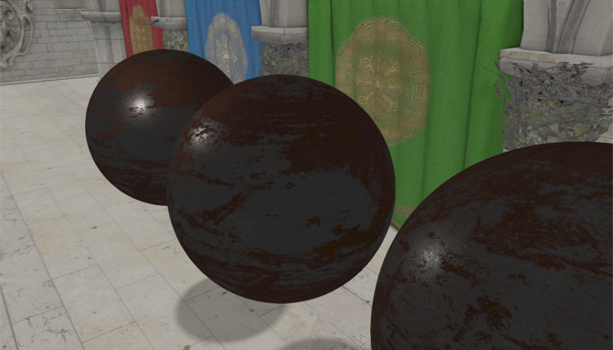
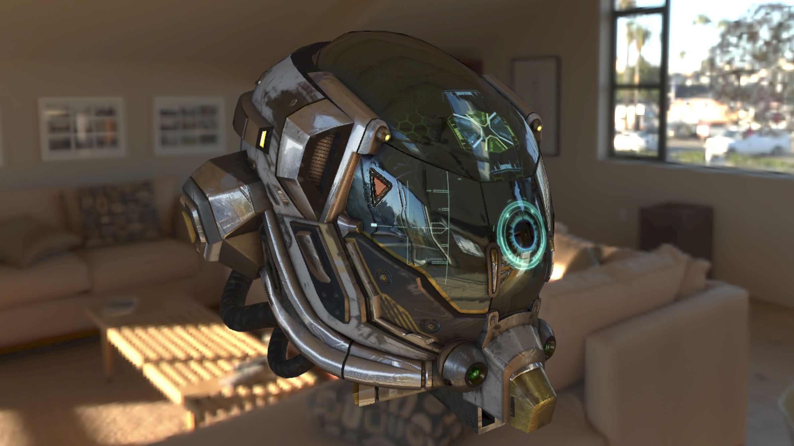
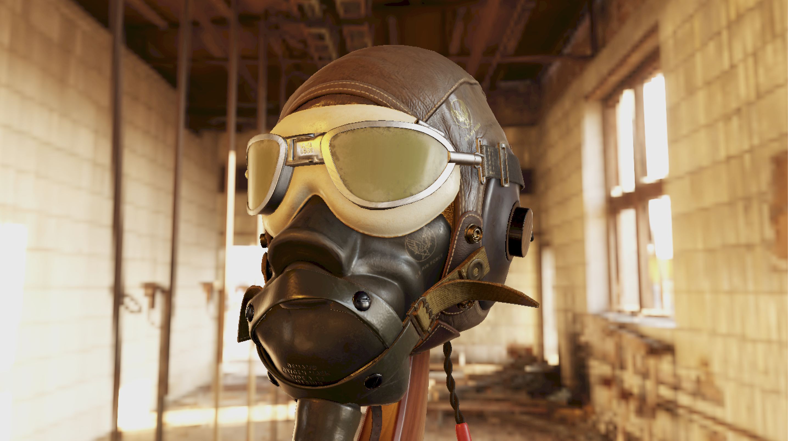
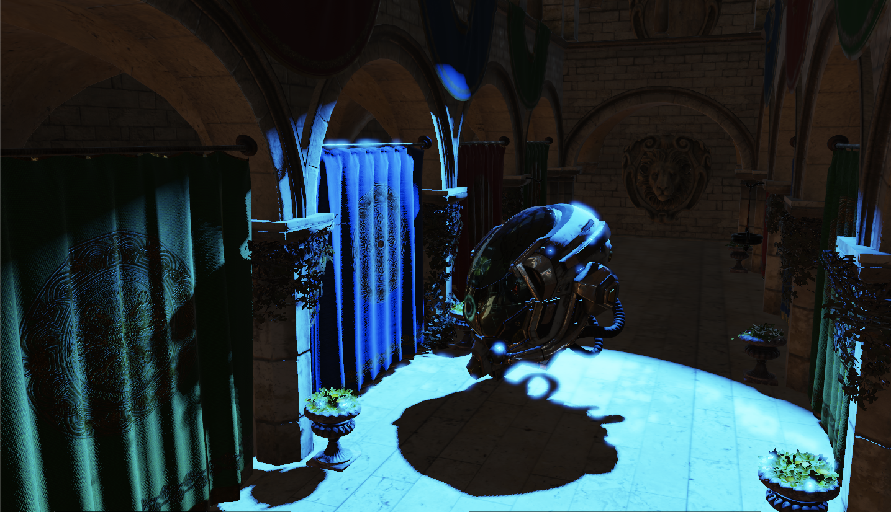
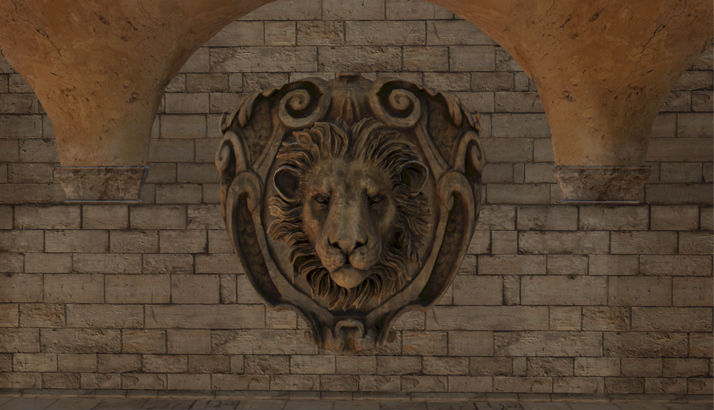
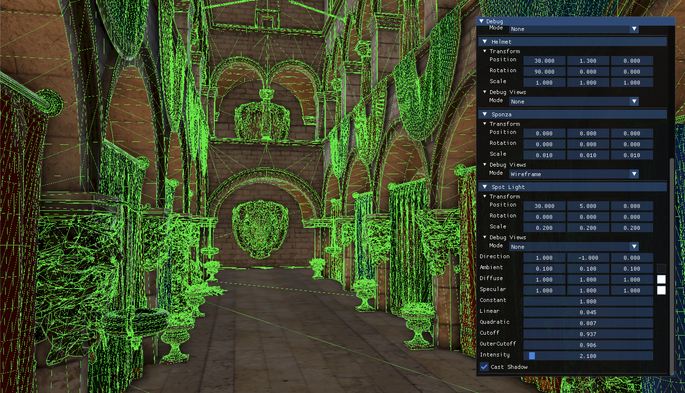
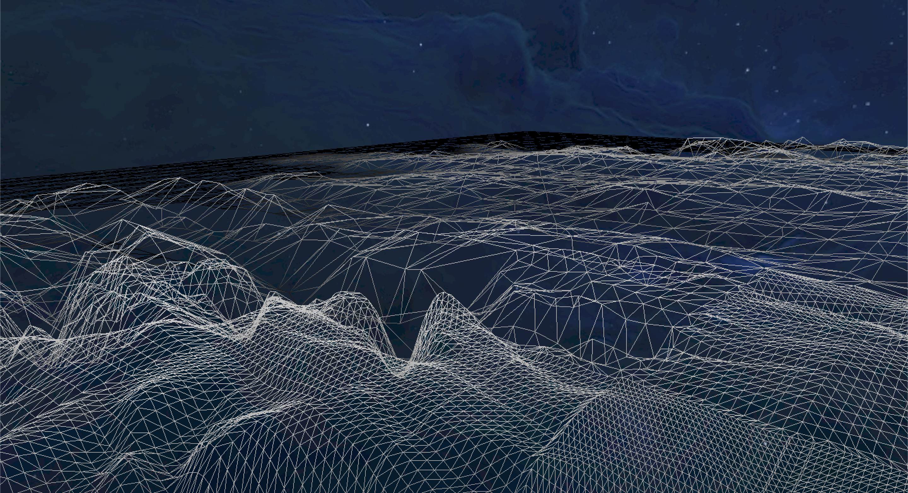

# Abra
`Abra` is a modern rendering engine built on OpenGL, featuring a flexible hybrid Forward + Deferred pipeline.
It’s designed for clarity, experimentation, and real-time graphics research — without bloated abstractions.
## Features
- **Hybrid Forward / Deferred Pipeline**
  - Deferred path is fully G-Buffer based, or you can switch to Forward anytime.
- **Opaque & Transparent Rendering**
  - Opaque objects go through Deferred or Forward (depending on your selected pipeline).
  Transparent objects always render in the Forward pipeline to keep blending sane.
- **Instanced Rendering (GPU Instancing)**
  - Efficiently draw many copies of the same mesh in a single draw call.
- **Lighting & Shadows**
  - Directional Light + Shadow Mapping
  - Point Light + Shadow Mapping (cubemap-based)
  - Spot Light + Shadow Mapping
- **HDR Rendering**
  - Full HDR workflow with tone mapping and manual exposure control.
- **PBR**
  - Image-based Lighting (IBL) with prefiltered environment cubemaps.
  - Load-time diffuse & specular irradiance cubemap convolution.
- **SSAO**
  - Only avaliable in the deferred pipeline.
- **Frustum Culling**
  - Per-entity and per-mesh culling.
- **Skybox Rendering** 
- **Advanced Materials**
  - Normal Mapping
  - Parallax Mapping
- **Anti-Aliasing**
  - MSAA (only avaliable in the forward pipeline) 
  - FXAA 
- **Post-Processing**
  - Modular, extendable post-FX chain (bloom, blur, tone mapping, gamma, etc.)
- **Entity Component System (ECS)**
    - Data-oriented architecture for flexible, efficient game objects.
- **Debug Tools**
  - Normal visualization
  - Wireframe mode
- **Tessellation Pipeline**
  - Terrain rendering with dynamic LOD
- **Built-in Models**
  - Cube – perfect for testing transforms, lighting, and shadow maps
  - Cubemap – used for skybox rendering
  - Plane
  - Sphere
  - Terrain
  - Screen Quad – for post-processing, deferred pipeline, and blitting
- **Supported Model Format**
  - Abra currently supports glTF 2.0 models only.Other formats (e.g., OBJ, FBX) are not supported.
- **PBR Workflow**
    - The engine follows the glTF metallic-roughness workflow.
    - Texture Conventions
      - Albedo (Base Color)
        - sRGB
      - Normal Map
        - Linear
      - Roughness-Metallic (packed)
        - Linear
        - Channels:
          - R → unused
          - G → Roughness
          - B → Metallic
      - Occlusion Map
        - Linear
        - Channels:
          - R → AO
        - Optionally AO can be baked into the Roughness-Metallic texture.
## Screenshots








## Controls
| Key  | Action                   |
|------|--------------------------|
| WASD | Move                     |
| RMB  | enable/disable Free Look |

## RUN
```bash
➜  ~ ./abra scene_Sponza_Spotlight.json
```
## Roadmap
- [ ] Cascaded shadow maps
## License
This project is licensed under the BSD 3-Clause License. See the LICENSE file for details.